# Marionette Whitepaper

<div align="center">

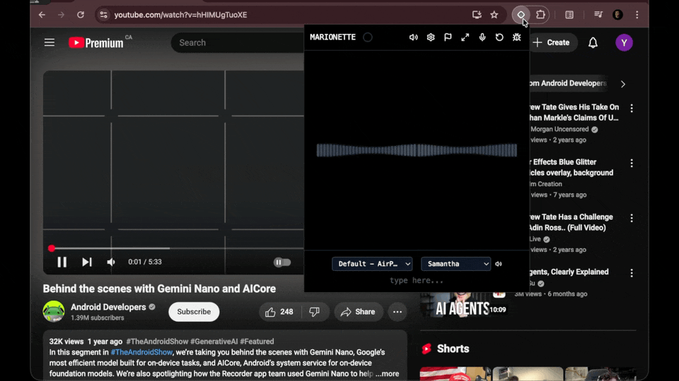

**AI browser automation agent powered by Chrome's built-in Gemini Nano**

**100% offline after one-time setup · Zero telemetry · Absolute privacy**


</div>

---

## Table of Contents

- [Overview](#overview)
- [Setup](#setup)
- [Design Notes](#design-notes)
  - [Constraints & Solutions](#the-constraints)
  - [Agent Core & Loopback](#the-agent-is-the-prompt-api)
  - [Multimodal Capabilities](#multimodal-understanding)
  - [Perception & Interaction](#perception-and-action-the-agent-webpage-interface)
  - [Playbook System](#aligning-the-model-with-playbooks)
  - [Embeddings Architecture](#embeddings-why-they-massively-boost-gemini-nano)
  - [Chunk-Based Retrieval](#auto-capture-vault-system-with-chunk-based-retrieval)
  - [File Embedding](#file-embedding-drag-and-drop-document-ingestion)
  - [Agent Alignment (Parsing, Loops, Summarization)](#tool-call-format-and-parsing)
  - [Tool Routing & Extensibility](#tool-routing-architecture)
  - [Rating System](#response-rating-and-future-alignment)
- [Tech Stack](#tech-stack)
- [Contributing](#contributing)
- [E2E Testing](#e2e-testing)

---

## Overview

Marionette removes digital barriers by letting you navigate and control any website using natural language, entirely offline and private. Voice-controlled, agentic, with semantic memory.

**Privacy-First Design:** After a one-time model download during setup (~2GB Gemini Nano + 23MB embeddings model), Marionette operates **100% offline**. Your conversations, captured pages, and browsing history never leave your device. No cloud inference, no telemetry, no API keys, no tracking. You can verify zero network activity by checking Chrome DevTools during normal operation.

**Key Features:**
- On-device AI agent (Gemini Nano via Chrome Prompt API)
- 22 automation tools (click, fill, scroll, capture, search)
- Agentic loopback system (up to 60 tool iterations per task)
- Multimodal input (text, voice, image, audio)
- Semantic memory vault with chunk-based RAG retrieval
- Drag-and-drop file embedding (PDF, TXT, MD, HTML, JSON)
- 384D embeddings via Transformers.js (all-MiniLM-L6-v2)
- Playbook-guided workflows for complex tasks
- 100% offline, zero telemetry

---

## Setup

### Prerequisites

### Enable Chrome Flags

Open `chrome://flags` and enable these flags, then **restart Chrome**:

**Required:**
- `#prompt-api-for-gemini-nano-multimodal-input` → **Enabled**
- `#optimization-guide-on-device-model` → **Enabled BypassPerfRequirement**

**Recommended:**
- `#summarization-api-for-gemini-nano` → **Enabled**
- `#writer-api-for-gemini-nano` → **Enabled**

**Optional:**
- `#translation-api` → **Enabled** (if using translateText tool)
- `#language-detection-api` → **Enabled** (if using detectLanguage tool)

### Join Early Preview Program

Chrome's built-in AI is in early preview. For best results, join the [Chrome AI Early Preview Program](https://developer.chrome.com/docs/ai/join-epp) to get early access to model updates and new capabilities.

### Installation

**Option 1: Build from source**

```bash
# Clone repository
git clone https://github.com/yourusername/marionette.git
cd marionette

# Install dependencies
pnpm install

# Build extension
pnpm build

# Load in Chrome
# 1. Go to chrome://extensions
# 2. Enable "Developer mode"
# 3. Click "Load unpacked"
# 4. Select the build/chrome-mv3-dev directory
```

**Option 2: [Install from Chrome Web Store](https://chromewebstore.google.com/detail/lleffmjgcoebjmdnphcfmmeafljckife)**

### First Run

1. Click the Marionette icon in your toolbar
2. Complete the onboarding flow:
   - **Welcome** - Introduction to capabilities
   - **Model Availability** - Extension checks if Gemini Nano is available
     - If not, provides direct links to enable required flags
   - **Microphone Permission** - Grant permission for voice input
   - **Purpose Selection** - Customize experience
3. Start using the agent!

The onboarding actively guides you through flag setup with clickable buttons that open the correct chrome://flags pages. If models aren't available, you'll get specific instructions on what to enable.

---

## Design Notes

We built Marionette to run a capable AI agent entirely on-device, which meant working around some tight constraints while keeping things snappy and reliable.

<div align="center">

</div>

### The Constraints

Gemini Nano is small and private, but that means limited reasoning power—it needs clear guidance to stay on track. The 9,216-token context window is a hard limit, so we have to save most of it for the actual conversation and tool outputs. And we can't just dump every tool into the prompt at once; that would overwhelm the model and waste tokens on irrelevant details.

### Our Solutions

The system prompt stays minimal by design. We expose a small core toolset—enough to perceive the page (captureScreenshot), navigate (openTab, switchTab), discover elements (findElements), and perform basic actions (clickElement, fillInput, listen). When complexity increases, the model can request domain-specific context by calling getPlaybook("task"), which provides relevant knowledge and unlocks specialized tools for that domain.

The agentic loop is straightforward: after each tool execution, we return the result with [TOOL RESULT] and let the model decide the next step. This continues until the task completes or the model determines it's done—no hardcoded branching, just repeated observation and action.

### Speak Human: Why Natural Language Beats Technical Jargon

Early in development, we discovered something counterintuitive: Gemini Nano performs significantly better when you hide technical terminology and use natural, everyday language instead.

When we exposed concepts like "accessibility tree" or "DOM snapshot," the model would get distracted—reasoning about accessibility compliance, debating tree traversal strategies, or overthinking implementation details. It would fixate on the technical terminology rather than just using the information.

The fix was simple: strip out the jargon. Instead of "accessibility tree," we say "page elements." Instead of "execute tool," we say "do this action." We present data in plain, action-oriented language that focuses on what the agent needs to do, not how the underlying system works.

This pattern holds across the entire system:
- Tool names avoid technical terms (clickElement, not invokeClickHandler)
- Error messages explain what went wrong in plain English
- System prompts describe capabilities naturally ("you can see" not "vision API available")
- Instructions focus on the task, not the mechanism

Small models have limited reasoning capacity. Technical jargon wastes that capacity on irrelevant abstraction. Natural language keeps the model focused on the actual task.

### The Agent Is the Prompt API

At the heart is Chrome's Prompt API running Gemini Nano. It takes multimodal inputs—text, images from screenshots, audio clips—and streams back responses. We scan those for tool calls, execute them, and loop the results back in. It's a simple cycle: input → think → act → observe → repeat.

<div align="center">
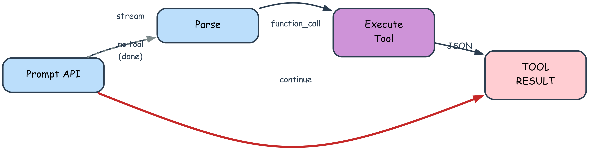
</div>

### Multimodal Understanding

The agent processes information across four modalities, enabling richer context and more accurate responses:

| Modality | Input Source | Format | Use Case |
|----------|--------------|--------|----------|
| Text | User typing, tool results | String | Commands, queries, form data |
| Voice | Web Speech API | Transcribed text | Hands-free control, dictation |
| Image | captureScreenshot | Blob (JPEG/PNG) | Visual verification, "what do you see?" |
| Audio | listen tool (tab audio) | Blob (audio data) | "Describe this podcast", "What's playing?" |

When a tool returns an image (screenshot) or audio (recording), we convert it to a blob and send it alongside the next prompt. The model receives both the text message and the media, enabling responses like "I see a login form with two fields" or "The audio contains a discussion about React hooks." This multimodal fusion happens transparently—the agent doesn't distinguish between text-only and media-enhanced prompts.

### Perception and Action: The Agent-Webpage Interface

The agent constructs a mental model of each webpage through multiple perception channels, then acts through DOM manipulation primitives. This bidirectional interface enables autonomous navigation and task completion.

**Perception Channels:**

| Channel | Tool | What It Captures | Agent Uses It To |
|---------|------|------------------|------------------|
| Visual | captureScreenshot | Rendered pixels, layout, colors | Understand spatial relationships, verify actions |
| Structural | Accessibility Tree | Interactive elements, roles, labels | Discover clickable targets, form inputs |
| Semantic | Readability.js | Clean content, article text | Extract meaning, answer questions |
| Contextual | Page metadata | Title, URL, timestamp | Orient in navigation flow, track state |
| Query | findElements | Indexed element references | Locate specific UI components by description |

<div align="center">
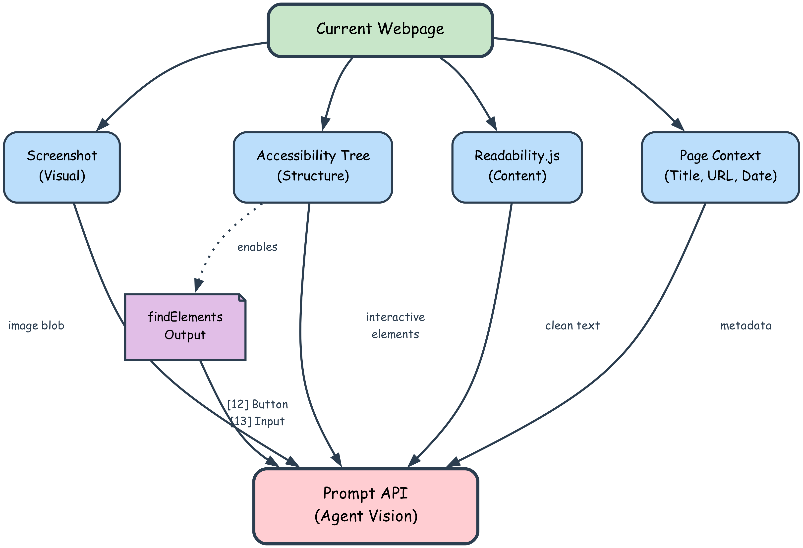
</div>

**Interaction Primitives:**

| Primitive | Parameters | DOM Operation | Use Case |
|-----------|-----------|---------------|----------|
| clickElement | index | element.click() | Buttons, links, submit actions |
| fillInput | index, value | element.value = X | Form fields, search boxes, text areas |
| scrollUp/Down | amount | window.scrollBy() | Long pages, infinite scroll, reveal content |
| pressKey | key | KeyboardEvent dispatch | Enter to submit, Escape to close, Tab to navigate |

<div align="center">
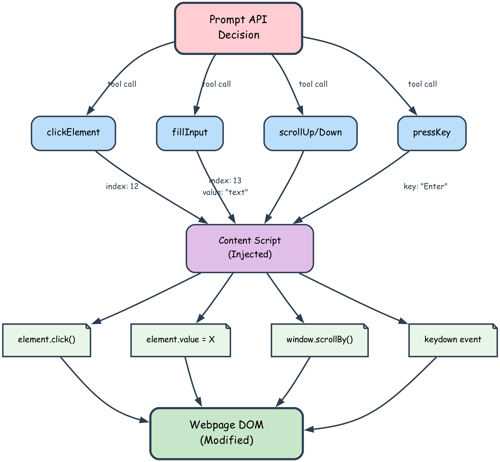
</div>

Element indices come from findElements, which queries the accessibility tree by natural language ("search button", "email input"). The agent receives numbered references like `[12] Button: "Submit"` and uses that index for precise targeting. This indirection layer prevents ambiguity—no guessing at selectors or XPaths.

### Aligning the Model with Playbooks

The small model needs domain context to behave reliably—understanding task patterns, knowing which tools are available, and recognizing common workflows. We can't rely on a massive prompt; instead, when a complex task like "fill this form" comes up, the agent can fetch a playbook. That's domain-specific context: common patterns, available specialized tools, best practices, and what to expect. The agent still decides autonomously—playbooks provide knowledge, not instructions. They align the model for that domain, loading just what's needed without prescribing exact steps.

**Context Savings with Playbooks:**

| Approach | Tools in Prompt | Est. Tokens Used | Available for Conversation |
|----------|----------------|------------------|----------------------------|
| All tools exposed | 22 tools | ~2,400 tokens | 6,816 tokens (74%) |
| Core + playbooks | 9 core tools | ~850 tokens | 8,366 tokens (91%) |

By deferring specialized tools to playbooks, we reclaim ~1,550 tokens—roughly an extra 1,200 words of conversation history or tool results.

<div align="center">
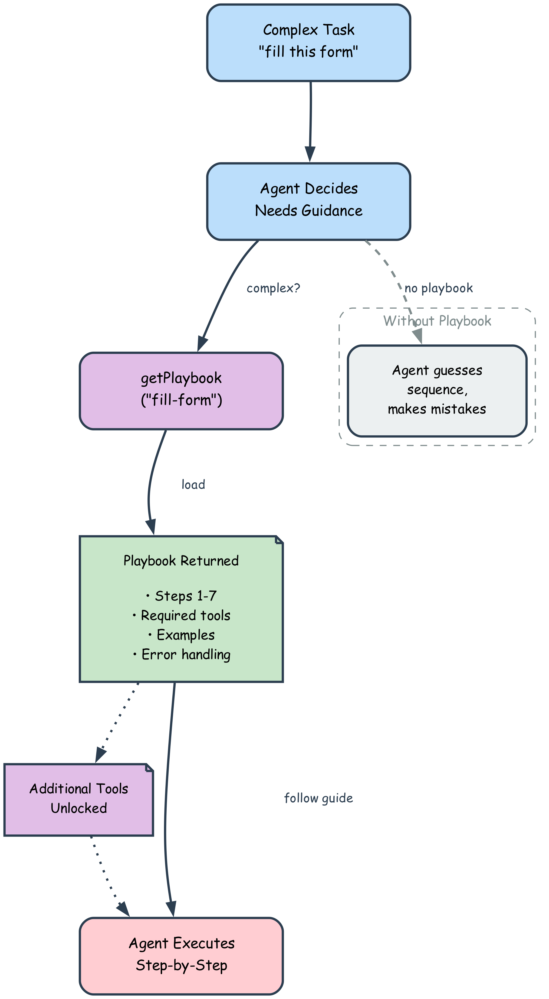
</div>

### Embeddings: Why They Massively Boost Gemini Nano

Gemini Nano is powerful but constrained by a 9,216-token context window. Without embeddings, retrieving information from captured pages would require dumping entire articles into the prompt, quickly exhausting available tokens and overwhelming the small model. Embeddings solve this by enabling **semantic search** that returns only the most relevant content.

**The Technical Stack:**

We use **Transformers.js** running the **all-MiniLM-L6-v2** model entirely in-browser. This is a sentence transformer that converts text into 384-dimensional vectors capturing semantic meaning. The model is compact (23MB ONNX) and fast (100-300ms per embedding), making it perfect for real-time use in a Chrome extension.

**Configuration for Browser Extension Environment:**

```typescript
// From lib/embeddings.ts
env.allowLocalModels = false        // Use CDN delivery (Hugging Face)
env.backends.onnx.wasm.numThreads = 1   // Single-threaded execution
env.backends.onnx.wasm.proxy = false    // No worker proxy (avoids CSP issues)
```

These settings are critical for Chrome extensions:
- **No local models**: The model downloads from CDN on first use and caches in browser storage
- **Single-threaded**: Runs on the main thread to avoid Content Security Policy restrictions in extension contexts
- **No worker proxy**: Direct execution prevents worker-related CSP violations

The model loads lazily using a singleton pattern—the first `generateEmbedding()` call triggers a one-time 23MB download, then subsequent calls reuse the cached pipeline. Inference happens via ONNX Runtime compiled to WebAssembly, running entirely offline after initial download.

**Token Savings with Semantic Search:**

| Approach | Example: "What did I read about React hooks?" | Tokens Used | Context Available |
|----------|----------------------------------------------|-------------|-------------------|
| Dump raw pages | Include full text of 3-5 relevant articles | 4,000-8,000 tokens | 1,216-5,216 tokens (13-57%) |
| Semantic search | Return titles, URLs, relevant chunks (top 3) | 150-300 tokens | 8,916-9,066 tokens (97-98%) |

A single large article (5,000 words) would consume ~6,500 tokens if included raw—**71% of Nano's entire context window**. With embeddings and chunk-based retrieval, we return 2-3 relevant snippets plus metadata, costing ~200 tokens—**just 2% of the context**.

This isn't just an optimization; it's what makes complex agentic workflows possible. Without embeddings, Nano would max out its context after retrieving one or two pages. With embeddings, it can reference dozens of captured pages and still have 90%+ of its context available for the actual conversation and tool execution.

**How Embeddings Enable Better Reasoning:**

1. **Semantic understanding**: Finds "contact information" even if the text says "reach us" or "get in touch"
2. **Precision**: Returns only the paragraph that answers the query, not the entire 5,000-word article
3. **Context preservation**: Nano can maintain long conversations with memory retrieval, tool execution history, and page references
4. **Faster responses**: Less text to process means quicker inference times
5. **Reduced hallucination**: The model sees actual relevant text, not a summary or approximation

<div align="center">
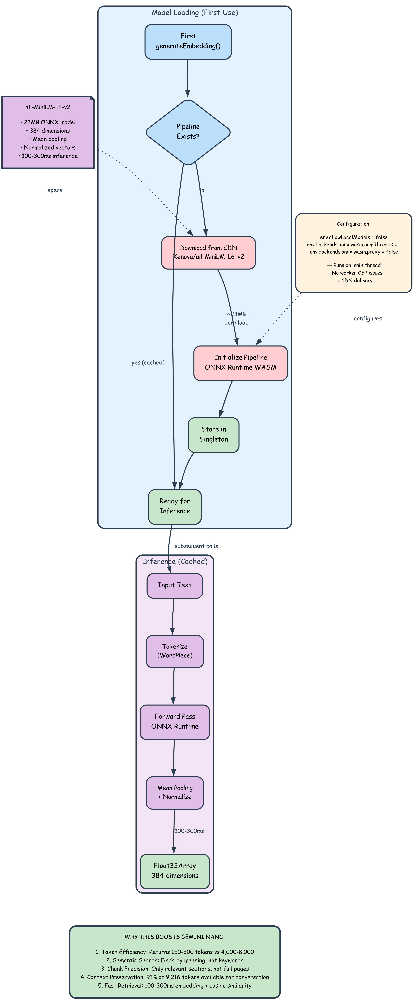
</div>

### Conversation Summarization

When the chat history approaches 80% of the context window (~7,300 tokens), we trigger Chrome's Summarizer API with a tuned prompt that preserves tool usage patterns, user preferences, and task state. The summarized history replaces the old messages, giving the model enough information to continue without losing critical context.

**Our summarization prompt:**

> Create a concise summary focusing on:
> 1. What task the user originally requested (e.g., "fill this form")
> 2. What specific actions the AI has already completed with exact details:
>    - List EACH form field that was filled with its index number and value (e.g., "Filled [12] First Name: John", "Filled [13] Last Name: Smith")
>    - Include which buttons were clicked, which pages were opened, etc.
> 3. What data the user has provided that hasn't been filled yet (list the exact values for each remaining field)
> 4. What fields remain to be filled (list field names with their index numbers from the accessibility snapshot)
> 5. What the IMMEDIATE next action should be (e.g., "Call fillInput for index 14 with email value")
>
> CRITICAL: Preserve ALL field indices, names, and user-provided values. Include the complete list of remaining fillInput calls needed.

After summarization, we prepend instructions to the agent:

> **[CONTEXT SUMMARIZED - Previous conversation]**
>
> [summary here]
>
> ---
>
> IMPORTANT: You are in the middle of a task. Based on the summary above:
> - IMMEDIATELY execute the next fillInput call with the exact index and value from the summary
> - DO NOT call think again
> - DO NOT ask for confirmation
> - DO NOT ask the user to repeat information they already provided
> - DO NOT restart the task from the beginning
> - Just make the next fillInput call right now, then continue with the remaining fields

This alignment ensures the agent doesn't lose track mid-task or ask users to repeat information.

<div align="center">
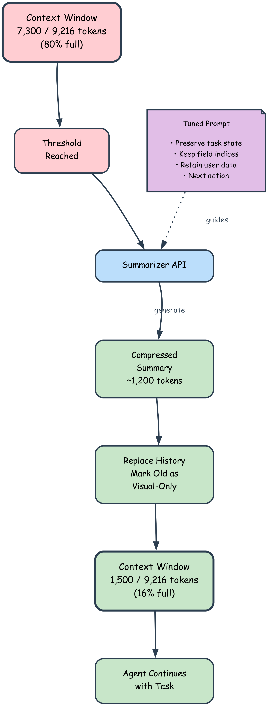
</div>

### Memory Setup

Memory comes in two flavors for different needs. Short user facts (like "email is john@example.com") go into agent memory in Chrome storage, with optional embeddings for quick semantic lookup. Webpage captures get cleaned with Readability.js, embedded via Transformers.js, and stashed in IndexedDB for cosine-similarity searches. The prompt pulls in agent memory summaries; vault queries happen on-demand with searchVault.

### Auto-Capture Vault System with Chunk-Based Retrieval

Every time you navigate to a new page, the extension waits three seconds for the page to settle, then automatically captures it in the background. We inject Readability.js to extract clean content—stripping ads, navigation, and cruft—and pass the text to Transformers.js running the all-MiniLM-L6-v2 model.

**How Storage Works:**

1. **Structured data extraction**: Before processing, extract and preserve contact information:
   - Email addresses (from `mailto:` links and regex patterns)
   - Phone numbers (from `tel:` links and North American format detection)
   - Social media profiles (Twitter, LinkedIn, Facebook, Instagram, GitHub)
2. **Content cleaning**: Use Readability.js to extract main content, strip ads and navigation
3. **Append structured data**: Add extracted contact info to content in a searchable format
4. **Page-level embedding**: Generate one embedding for the entire page (used for broad relevance ranking)
5. **Content chunking**: Split the cleaned text into overlapping 500-character chunks with 100-character overlap
6. **Chunk-level embeddings**: Generate a 384D embedding for each chunk (typically 8-15 chunks per page)
7. **IndexedDB storage**: Store both the page metadata and all chunks with their embeddings

The structured data extraction solves a critical problem: email addresses and phone numbers are often hidden in HTML attributes (`<a href="mailto:doctor@example.com">Contact</a>`). Without extracting them first, Readability.js would strip out "doctor@example.com" and only keep "Contact". Now when you search for "email" or "contact", the vault returns the actual email addresses and phone numbers.

The overlap ensures that content spanning chunk boundaries isn't lost. A 5,000-word article becomes ~10 chunks, each with its own semantic vector. Storage happens silently in the background—you don't notice it.

<div align="center">
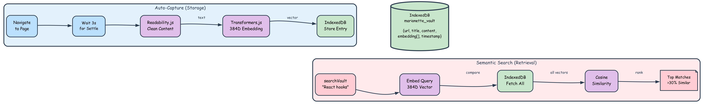
</div>

**How Retrieval Works:**

When the agent needs information—"What did I read about React hooks?"—it calls `searchVault("React hooks")`:

1. **Query embedding**: Generate a 384D vector for the search query
2. **Chunk-level search**: Compare query embedding against **all chunks** from all pages using cosine similarity
3. **Filtering**: Keep only chunks with >20% similarity (configurable threshold)
4. **Grouping**: Group matched chunks by their source page
5. **Ranking**: Take the top 2-3 most relevant chunks per page
6. **Results**: Return pages ranked by their best-matching chunk, with the actual relevant text snippets

**What the Agent Receives:**

Example 1 - Technical content:
```
[1] Understanding React Hooks [78% match]
   react.dev • 4,523 words
   https://react.dev/learn/hooks

   Relevant content:
   1. Hooks are functions that let you "hook into" React state and 
      lifecycle features from function components. useState is the most 
      common hook, allowing you to add state to function components...

   2. The useEffect hook lets you perform side effects in function 
      components. It serves the same purpose as componentDidMount, 
      componentDidUpdate, and componentWillUnmount...
```

Example 2 - Contact information (query: "new brunswick doctor email"):
```
[1] Family Medicine New Brunswick [85% match]
   www.fmnb.ca • 1,247 words
   https://www.fmnb.ca/contact

   Relevant content:
   1. For inquiries about family medicine services in New Brunswick, 
      please contact our central office. We're here to help connect 
      you with a family doctor.
   
   2. Contact Emails: info@fmnb.ca, referrals@fmnb.ca, admin@fmnb.ca
      Contact Phones: (506) 555-1234, 1-800-555-FMNB
```

The structured data extraction ensures that email addresses, phone numbers, and social media links are preserved and searchable, even when they're hidden in HTML attributes.

**Why This is Better Than Simple Excerpt-Based Search:**

| Approach | What Agent Gets | Problem |
|----------|-----------------|---------|
| Page-level embedding only | Title + first 200 characters | Relevant content buried on page 3 is missed |
| Full page dump | Entire 5,000-word article | Uses 6,500 tokens (71% of Nano's context) |
| **Chunk-based retrieval** | **Title + 2-3 relevant ~500-char chunks** | **Only relevant sections, ~200 tokens (2% of context)** |

If a page discusses React hooks in paragraph 47 of a long article, traditional search might return the page with an irrelevant excerpt from paragraph 1. Chunk-based retrieval finds paragraph 47 specifically because it has the highest semantic similarity to your query.

<div align="center">
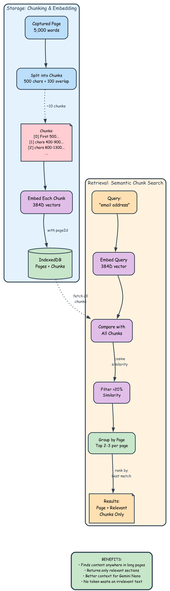
</div>

**Storage Architecture:**

```
IndexedDB: marionette_vault (v2)
├─ pages store
│  ├─ id, url, title, domain
│  ├─ content (full text with appended structured data, max 5,000 words)
│  │   • Main content from Readability.js
│  │   • Extracted emails (from mailto: links + regex)
│  │   • Extracted phones (from tel: links + regex)
│  │   • Social media links (Twitter, LinkedIn, etc.)
│  ├─ embedding (384D, page-level)
│  └─ timestamp, wordCount
│
└─ chunks store
   ├─ id (pageId-chunkIndex)
   ├─ pageId (foreign key)
   ├─ content (~500 chars, may include structured data)
   ├─ embedding (384D, chunk-level)
   └─ chunkIndex, startChar, endChar
```

The vault grows indefinitely (IndexedDB has no practical storage limit in extensions), though cleanup logic exists to cap storage at 100 pages if needed. The assumption is: more history is better, and chunk-level search makes it all accessible.

### File Embedding: Drag-and-Drop Document Ingestion

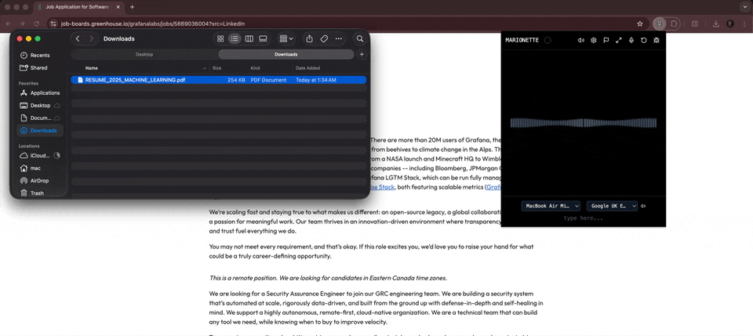

Local documents—resumes, research papers, meeting notes—need to be searchable alongside captured webpages. File embedding extends the vault system to handle local files through the same semantic search pipeline.

**Supported File Types:**

| Format | Parser | What It Extracts |
|--------|--------|------------------|
| PDF | pdfjs-dist | Text + metadata (title, author, page count) |
| TXT | Native | Plain text content |
| MD | Native | Markdown with formatting preserved |
| HTML | DOMParser | Main content text |
| JSON | Native | Structured data as text |

**Processing Pipeline:**

<div align="center">
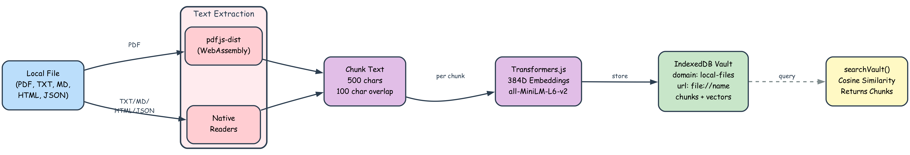
</div>


Files enter the same embedding flow as webpages: text extraction → chunking → embedding generation → IndexedDB storage. The only difference is the extraction method—PDFs use pdfjs-dist, text files read directly, HTML parses the DOM.

**PDF Extraction:**

PDF text extraction uses `pdfjs-dist` running in-browser via WebAssembly. The worker file is bundled with the extension and loaded via `chrome.runtime.getURL()`, ensuring offline operation without CDN dependencies.

```typescript
pdfjsLib.GlobalWorkerOptions.workerSrc = chrome.runtime.getURL('assets/pdf.worker.min.mjs')

const pdf = await pdfjsLib.getDocument({
  data: arrayBuffer,
  useWorkerFetch: false,  // CSP restrictions
  isEvalSupported: false,  // Extension security
  useSystemFonts: true
})
```

Text extraction is page-by-page with spatial awareness—spaces between distant words, newlines between different y-coordinates. This preserves document structure.

**Storage:**

Each file becomes a vault entry:
- `domain: 'local-files'` (distinguishes from webpage captures)
- `url: 'file://filename.pdf'` (unique identifier)
- `metadata`: fileName, fileType, fileSize, lastModified
- Full content + chunks with embeddings (same as pages)

Once stored, the agent can search via `searchVault("work experience")` and retrieve relevant sections from embedded resumes, notes, or documentation. The vault doesn't distinguish between webpages and files—both are just searchable text with embeddings.

### Privacy and Security: 100% Offline After Initial Setup

Marionette is designed for absolute privacy. After a one-time setup, **everything runs entirely on your device with zero network communication**.

**The One-Time Model Download (During Onboarding):**

On first use, the extension downloads two models:
1. **Gemini Nano**: Downloaded by Chrome itself when you enable the required flags. This happens through Chrome's built-in model distribution system (not controlled by this extension). Size: ~1.5-2GB, downloaded once per Chrome installation.
2. **all-MiniLM-L6-v2 embeddings model**: Downloaded via Transformers.js from Hugging Face CDN on first call to `generateEmbedding()`. Size: ~23MB ONNX model, cached in browser storage after first download.

Both downloads happen automatically during setup. Gemini Nano is managed by Chrome's Prompt API infrastructure. The embeddings model downloads from CDN (Hugging Face) and caches locally using browser's built-in caching mechanisms.

**After Initial Setup - Fully Offline:**

Once models are downloaded, **no network activity occurs**:

| Component | Network Usage | Privacy Impact |
|-----------|---------------|----------------|
| Gemini Nano inference | **Zero** - runs via Chrome's on-device Prompt API | Your prompts never leave your machine |
| Embeddings generation | **Zero** - ONNX Runtime WASM runs locally | Text embeddings computed on-device |
| Vault storage | **Zero** - IndexedDB is local browser storage | Captured pages stay on your disk |
| Conversation history | **Zero** - stored in extension's local storage | Chat logs are private |
| Tool execution | **Zero** - DOM manipulation, local APIs only | No telemetry or analytics |
| Page captures | **Zero** - Readability.js runs in-page | Content never sent anywhere |

**What This Means:**

- **No cloud inference**: Your conversations aren't sent to any server
- **No telemetry**: We don't collect usage statistics, crash reports, or analytics
- **No API keys**: No accounts, no authentication, no external services
- **No tracking**: The extension doesn't phone home or report anything
- **Airplane mode compatible**: After initial setup, works completely offline (even disconnected from internet)

You can verify this by opening Chrome DevTools Network tab while using Marionette—you'll see zero network requests from the extension during normal operation.

**Storage Security:**

- **IndexedDB sandboxing**: The vault (captured pages, embeddings, chunks) is stored in IndexedDB, which is sandboxed to the extension's origin. No website can read it, no other extension can access it.
- **Extension storage isolation**: Conversation history and agent memories use Chrome's extension storage API, isolated from web pages and other extensions.
- **Data deletion**: Uninstalling the extension immediately purges all stored data (conversations, vault, memories, embeddings).

**The Privacy Trade-Off:**

Running everything on-device means:
- ✅ **Absolute privacy**: Your data never leaves your machine
- ✅ **No subscription**: No API costs or usage limits
- ✅ **Works offline**: No internet dependency after setup
- ⚠️ **Slower inference**: 1-3 seconds per response vs. <1s for cloud models
- ⚠️ **Smaller model**: Gemini Nano (3B parameters) vs. GPT-4 (hundreds of billions)

For many users, the privacy benefit far outweighs the performance trade-off. You're running a capable AI agent with zero data leaving your device—that's unprecedented.

### Tool Call Format and Parsing

The model outputs tool calls in a strict XML-like format: `<function_call>{"function": "toolName", "arguments": {...}}</function_call>`. We parse this aggressively, looking for common mistakes small models make—missing closing braces, using code blocks instead of raw tags, forgetting the arguments field. When we detect malformed syntax (like wrapping the call in ```json or ```tool_code), we return an error message that explicitly tells the agent what went wrong and how to fix it.

**Example format error correction:**

> STOP using code blocks! Just write this directly (no backticks, no code blocks):
>
> `<function_call>{"function": "findElements", "arguments": {"query": "email"}}</function_call>`
>
> Do NOT write: \`\`\`tool_code or \`\`\`json or \`\`\`function_call
> Just write the <function_call> directly in your response.

This corrective feedback loop is essential: Nano's small size means it occasionally forgets the format mid-conversation, especially after long tool chains. We catch it immediately and guide it back on track.

### Detecting and Breaking Loops

Small models can get stuck. The agent might call captureScreenshot three times in a row, or cycle through findElements → clickElement → findElements without making progress. We track recent tool calls and detect two patterns: identical tools repeated three consecutive times, or cyclic sequences (A → B → C → A → B → C). When either pattern emerges, we inject a warning as a tool result.

**Example loop detection warning:**

> **[TOOL RESULT]**
>
> LOOP DETECTED: You've called captureScreenshot three times in a row. Stop calling tools and describe what you've learned from the previous screenshots.

Or for cyclic patterns:

> **[TOOL RESULT]**
>
> LOOP DETECTED: You're repeating the same sequence of tools (findElements, clickElement, findElements) without making progress. Stop calling tools and provide your final answer based on the information you already have.

The model reads this, understands it's stuck, and pivots to a text response instead of continuing the loop. It's not perfect, but it works surprisingly well—most loops break on the first warning.

We monitor improvements to the Nano API closely. As the model gets better at reasoning and following instructions, we can gradually remove these guardrails. But for now, they're necessary to keep the agent reliable and prevent frustrating dead ends.

### Tool Routing Architecture

Not all tools execute the same way. Most tools—navigation, DOM manipulation, memory operations—run in the background service worker via chrome.runtime.sendMessage. We validate the tool name against a registry, dispatch to the appropriate handler, and return the result. Simple and fast.

But some tools require a user gesture (like writeContent, which uses Chrome's Writer API). These can't run in the background; they need to execute in the UI context where user interaction just happened. We flag these tools with requiresUserGesture: true and route them to a separate executeUITool pipeline that runs directly in the popup or sidepanel. The agent doesn't know or care about this distinction—it calls the tool, we handle the routing, and the result comes back the same way.

Other tools, like listen or captureScreenshot, need content script injection to access the page or tab media. We check the context, inject scripts if needed, execute, and clean up. The routing layer abstracts all this complexity: from the agent's perspective, every tool is just a function call with a JSON result.

<div align="center">
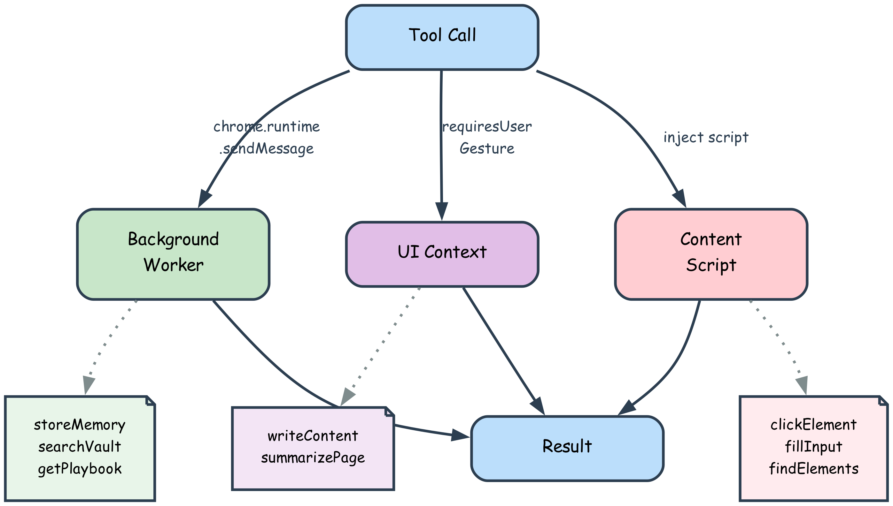
</div>

### Extensibility and Modularity

The architecture is designed for easy extension. Adding new capabilities requires minimal changes:

**Adding a New Tool:**

1. Create `lib/tools/myTool.ts` with an async handler function
2. Export a `ToolSpec` describing parameters, examples, and usage
3. Register it in `background.ts` tool handlers
4. Optionally add to `lib/core-tools.ts` for default exposure, or leave for playbook-only use

**Adding a New Playbook:**

1. Create `lib/playbooks/myWorkflow.ts` with domain context and common patterns
2. List available specialized tools and provide usage examples
3. Export and register in `lib/playbooks/index.ts`
4. Agent can now call `getPlaybook("myWorkflow")` to load domain knowledge

**Architecture Benefits:**

- **Decoupled tools**: Each tool is self-contained with its own spec, handler, and error handling
- **Lazy loading**: Tools not in the core set only load when a playbook requests them
- **Central registry**: `tool-registry.ts` auto-aggregates all tool specs from imports
- **Context-aware routing**: Background vs UI vs content script execution determined by flags, not hardcoded paths
- **Graceful degradation**: Tools return structured errors that guide the agent toward alternatives

This modularity means new automation capabilities can be added without touching the agent core, system prompt, or execution loop. The playbook system further isolates complexity—a new domain doesn't require new tools, just contextual knowledge that helps the agent leverage existing primitives effectively.

### Response Rating and Future Alignment

Every agent response includes thumbs up/down buttons. When you rate a message, we capture the entire context: the full conversation history, the system prompt that was active, and the tool calls that were made. This data goes into a local IndexedDB (separate from the vault), indexed by timestamp and rating type.

**What We Store:**

| Field | Content | Purpose |
|-------|---------|---------|
| messageId | Unique message identifier | Link rating to specific response |
| rating | 'up' or 'down' | Quality signal |
| chatContext | Full conversation + system prompt | Understand what led to this response |
| systemPrompt | Tool docs + memories at that moment | Capture the agent's "view" |
| timestamp | When the rating occurred | Track improvement over time |

Right now, this data stays local—it's purely for debugging and understanding failure modes. But the structure enables future improvements:

- **Preference learning**: Extract patterns from positively-rated interactions to bias tool selection
- **Prompt refinement**: Analyze highly-rated conversations to optimize system prompt phrasing
- **Playbook optimization**: Identify which playbook patterns cause confusion (low ratings) and improve context
- **Few-shot examples**: Use top-rated interactions as in-context examples for similar tasks
- **Error pattern analysis**: Cluster negatively-rated responses to find systematic failures (format errors, loops, hallucinations)

If Chrome ever supports on-device fine-tuning or preference alignment APIs, we have a curated dataset ready. Until then, the ratings help us manually iterate on prompts and playbooks based on real usage patterns.

### Chrome Extension Scope and Limitations

Chrome extensions have broad but not unlimited capabilities. We can capture screenshots, inject content scripts to manipulate the DOM, read accessibility trees, and switch tabs. But there are boundaries: the listen tool (for capturing page audio) only works in the sidepanel context, not the popup, due to Chrome's media capture restrictions. When the agent tries to call listen from the wrong context, the tool returns an error with clear instructions—"tell the user to open the sidepanel"—so the model can relay that requirement naturally. We design tools to fail gracefully with actionable messages, aligning the model's behavior with what's actually possible.

---

## Tech Stack

| Category | Technology | Purpose |
|----------|-----------|---------|
| Framework | Plasmo | Chrome extension framework with React support |
| Package Manager | pnpm | Fast, efficient dependency management |
| Language | TypeScript 5.3 | Type-safe development |
| UI | React + Tailwind CSS | Component-based interface with utility styling |
| State | Zustand | Lightweight state management |
| AI | Chrome Prompt API | On-device Gemini Nano inference |
| Embeddings | Transformers.js | In-browser ML (all-MiniLM-L6-v2) |
| Storage | IndexedDB | Semantic vault, rating database |
| Voice | Web Speech API | Voice input transcription |
| Wake Word | Porcupine | "Hey Marionette" detection |
| Content Extraction | Readability.js | Clean webpage content |
| Build | esbuild (via Plasmo) | Fast bundling and hot reload |

---

## Contributing

Contributions welcome! Here's how to get started.

### Codebase Structure

```
marionette/
├── background.ts           # Service worker, tool routing, message handling
├── content.ts              # Content script injected into webpages
├── popup.tsx               # Quick access popup UI
├── sidepanel.tsx           # Full-height side panel UI
├── lib/
│   ├── ai.ts               # Prompt API integration, streaming, multimodal
│   ├── chat-context.tsx    # Agent loop state, loopback logic, summarization
│   ├── embeddings.ts       # Transformers.js, cosine similarity, all-MiniLM-L6-v2
│   ├── vault.ts            # Semantic vault with chunk-based RAG (IndexedDB)
│   ├── auto-capture.ts     # Background page capture system
│   ├── tools.ts            # Tool parsing and execution
│   ├── tool-registry.ts    # Central tool registry, validation
│   ├── core-tools.ts       # Tools exposed in system prompt by default
│   ├── ui-tools.ts         # Tools requiring user gesture (Writer, Summarizer)
│   ├── playbooks/          # Workflow guides (form, search, email, listen)
│   ├── tools/              # Individual tool implementations (22 tools)
│   └── prompts/            # System prompt, summarization prompts
├── components/             # React components
│   ├── onboarding/         # First-run experience, model checks
│   ├── waveform.tsx        # Voice input visualization
│   └── ...
└── diagrams/               # Architecture diagrams (Python + Graphviz)
```

### Adding a New Tool

Tools are self-contained modules with a handler function and a spec describing their interface.

**1. Create the tool file:**

```typescript
// lib/tools/myTool.ts
import type { ToolSpec } from '../tool-registry'

async function myTool(params: any) {
  const { arg1, arg2 } = params
  
  // Validation
  if (!arg1) {
    return { success: false, error: 'arg1 is required' }
  }
  
  // Implementation
  try {
    const result = await doSomething(arg1, arg2)
    return { success: true, result: result }
  } catch (error: any) {
    return { success: false, error: error.message }
  }
}

export const spec: ToolSpec = {
  name: 'myTool',
  description: 'Brief description of what this tool does',
  parameters: [
    {
      name: 'arg1',
      type: 'string',
      description: 'What arg1 represents',
      required: true
    },
    {
      name: 'arg2',
      type: 'number',
      description: 'What arg2 represents',
      required: false
    }
  ],
  examples: [
    'User: "do something" → myTool with arg1: "value"',
    'Useful in workflow X when Y happens'
  ],
  spokenLine: 'Doing the thing'  // What agent "says" when executing
}

export default myTool
```

**2. Register in background.ts:**

```typescript
import myTool from './lib/tools/myTool'

const toolHandlers: Record<string, ToolHandler> = {
  // ... existing tools
  myTool
}
```

**3. Add to core tools (optional):**

If this tool should be available by default (not gated by playbooks), add it to `lib/core-tools.ts`:

```typescript
export const CORE_TOOLS = [
  'think',
  'getPlaybook',
  // ... existing
  'myTool'  // Add here
]
```

Otherwise, leave it out and reference it in a playbook.

### Adding a New Playbook

Playbooks provide domain context and specialized tools—the agent still decides autonomously.

**1. Create the playbook:**

```typescript
// lib/playbooks/myWorkflow.ts
import { type Playbook } from './types'

export const myWorkflowPlaybook: Playbook = {
  id: 'my-workflow',
  description: 'Domain context for workflow tasks',
  requiredTools: ['tool1', 'tool2', 'tool3'],
  contents: `## Workflow Domain Context

You've loaded context for workflow automation tasks.

AVAILABLE SPECIALIZED TOOLS:
- tool1: Used for X operations. Example: tool1({param: "value"})
- tool2: Handles Y scenarios. Best when Z conditions exist.
- tool3: Retrieves W data. Returns structured JSON.

COMMON PATTERNS IN THIS DOMAIN:
- Tasks typically require tool1 first to establish state
- tool2 responses often contain field indices for further interaction
- Users expect status updates for long operations
- Error states can usually be recovered by retrying with adjusted params

BEST PRACTICES:
- Wait for each tool result before deciding next action
- Use actual values from results, never placeholders
- If uncertain, use think() to reason about next step
- Explain your reasoning to the user when making key decisions

You decide how to approach the task autonomously using this context.`
}
```

**2. Register the playbook:**

```typescript
// lib/playbooks/index.ts
import { myWorkflowPlaybook } from './myWorkflow'

export const PLAYBOOKS: Playbook[] = [
  searchPlaybook,
  emailPlaybook,
  formPlaybook,
  listenPlaybook,
  myWorkflowPlaybook  // Add here
]
```

**3. Agent can now load it:**

User: "Do the workflow"
Agent: `getPlaybook("my-workflow")` → receives domain context → decides autonomously

### Key Files to Understand

**Agent Loop (`lib/chat-context.tsx`):**
- The `sendMessage` function contains the entire agentic loop
- Streams response from Prompt API
- Parses for tool calls
- Executes tools and feeds results back
- Detects infinite loops and format errors
- Handles summarization triggers

**Tool Execution (`lib/tools.ts`):**
- `parseToolCall` - Extracts function name and arguments, fixes common mistakes
- `detectInvalidToolFormat` - Catches code blocks and wrong syntax
- `executeTool` - Routes to background worker via chrome.runtime.sendMessage

**System Prompt (`lib/prompts/system-prompt.ts`):**
- Template with placeholders: `{{TOOLS}}`, `{{MEMORIES}}`, `{{CURRENT_CONTEXT}}`
- Filled at runtime with tool docs, stored memories, current page info
- Injected into Prompt API at session creation

**Tool Registry (`lib/tool-registry.ts`):**
- Auto-aggregates tool specs from imports
- Provides `isValidTool` and `findSimilarTools` for validation
- Separates UI tools (requiresUserGesture) from background tools

### Development Workflow

```bash
# Start dev server with hot reload
pnpm dev

# Build for production
pnpm build
```

### Areas for Contribution

**High Priority:**
- **Porcupine wake word detection** - Currently non-functional in browser context; requires engineering to work with Web Audio API or service worker constraints
- Additional playbooks (booking flights, shopping, research workflows)
- Tool improvements (better error messages, more robust parsing)
- Prompt engineering (optimize alignment, reduce hallucinations)
- Performance profiling (identify bottlenecks in tool execution)

**Medium Priority:**
- UI polish (animations, better visualizations)
- More perception tools (DOM query capabilities, XPath support)
- Vault enhancements (export/import, chunk size optimization, re-ranking algorithms)
- Rating analysis (scripts to extract patterns from stored ratings)

**Experimental:**
- Fine-tuning support (if Chrome ever exposes it)
- Multi-agent collaboration (coordinating multiple Nano instances)
- Advanced memory (vector clustering, topic modeling)
- Tool composition (combining simple tools into complex ones)

---

## License

MIT License - See [LICENSE.txt](./LICENSE.txt)
