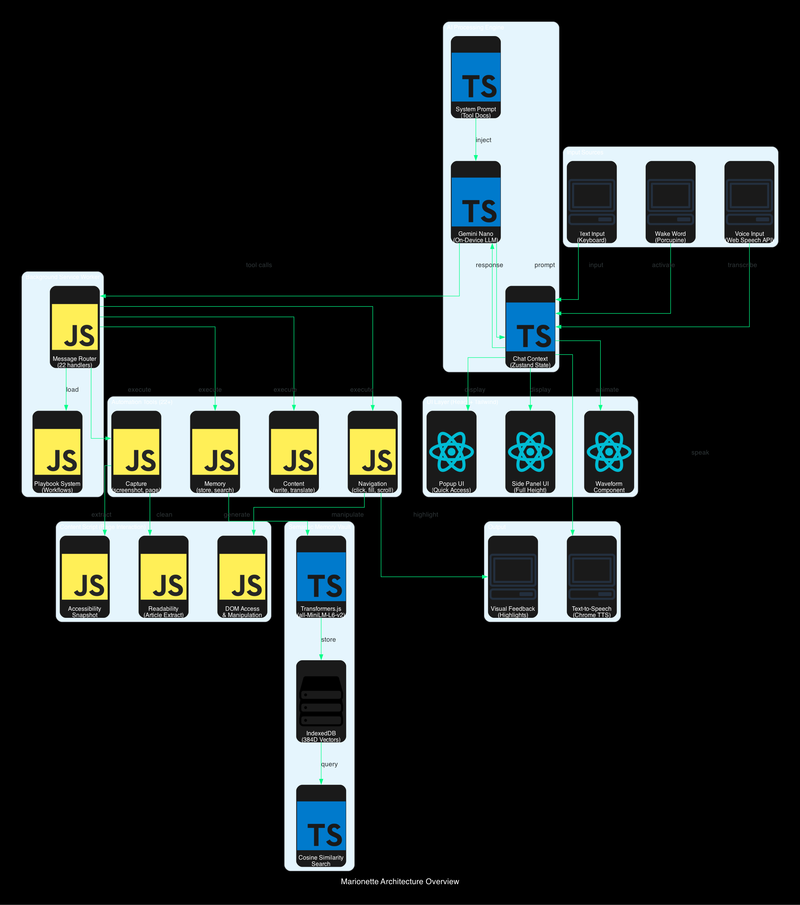
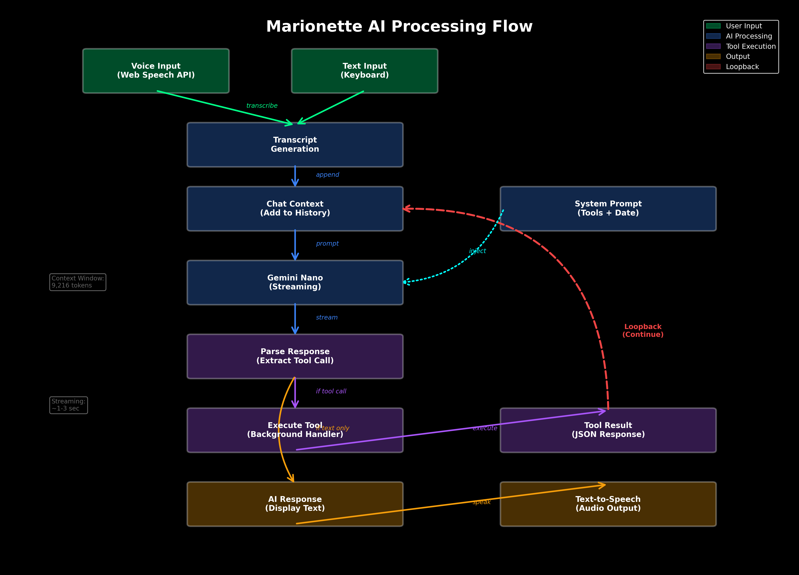
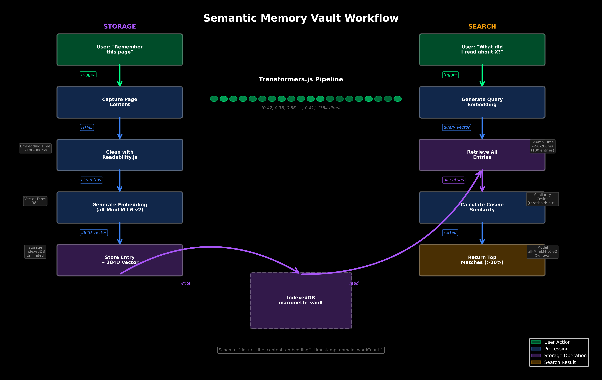
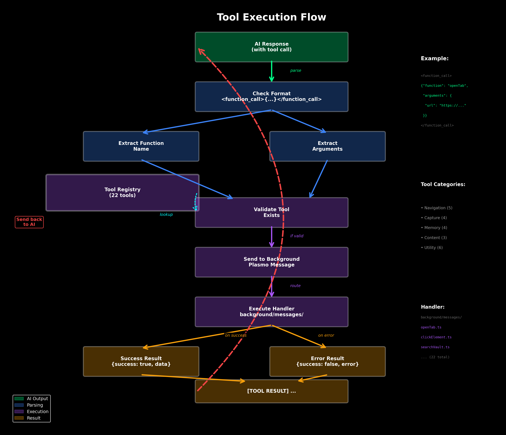

<p align="center">
  
</p>

<h1 align="center">Marionette</h1>

<p align="center">
  <b>Navigate and control any website using natural language, entirely offline and private.</b>
</p>

<p align="center">
  <a href="https://www.typescriptlang.org/"></a>
  <a href="https://react.dev/"></a>
  <a href="https://www.plasmo.com/"></a>
  <a href="./LICENSE.txt"></a>
  <a href="https://chrome.google.com/webstore"></a>
</p>



> **Note:** To generate all diagrams, run: `cd diagrams && ./generate_all.sh`

## Overview

Marionette is a revolutionary browser extension that removes digital barriers by enabling **voice-controlled web automation** powered by Chrome's built-in **Gemini Nano AI**. Unlike traditional automation tools, Marionette runs **100% locally** on your device—no cloud APIs, no data leaving your machine, completely private.

### Key Features

| Feature                        | Description                                                                                  |
|--------------------------------|----------------------------------------------------------------------------------------------|
| 🎤 **Voice Control**           | Navigate websites hands-free with natural language commands                                   |
| 🧠 **On-Device AI**            | Powered by Chrome's Gemini Nano—no internet required for processing                          |
| 🔒 **Privacy First**           | All processing happens locally; your data never leaves your device                           |
| 🎯 **Wake Word Detection**     | Hands-free activation with "Hey Marionette" using Picovoice Porcupine                       |
| 🗄️ **Semantic Memory Vault**   | Store and search web pages using AI-powered embeddings (384D vectors)                        |
| 🤖 **Smart Playbooks**         | Pre-built workflows for complex tasks (search, email, etc.)                                  |
| 🔧 **22+ Automation Tools**    | Click, fill, scroll, translate, screenshot, and more                                         |
| 🌐 **Multilingual Support**    | Text-to-speech in multiple languages and voices                                              |
| ⚡ **Real-time Streaming**     | See AI responses as they're generated                                                        |

## Visual Diagrams

Marionette includes comprehensive visual documentation. All diagrams can be generated using Python scripts in the `diagrams/` directory.

### Architecture Overview


### AI Processing Flow


### Memory Vault Workflow


### Tool Execution Flow


### Playbook System


**To generate diagrams:** See [diagrams/README.md](./diagrams/README.md) for instructions.

## Architecture

```
marionette/
├── popup.tsx                    # Extension popup UI (main entry)
├── sidepanel.tsx               # Side panel UI (full-height mode)
├── content.ts                  # Content script (page interaction)
├── background.ts               # Service worker (message handling)
│
├── screens/
│   ├── main-screen.tsx         # Voice interface & waveform UI
│   └── debug-screen.tsx        # Developer debugging tools
│
├── lib/
│   ├── ai.ts                   # Gemini Nano integration
│   ├── embeddings.ts           # Transformers.js (all-MiniLM-L6-v2)
│   ├── vault.ts                # IndexedDB semantic search
│   ├── use-voice-input.ts      # Speech recognition hook
│   ├── use-speech-recognition.ts
│   ├── tts-context.tsx         # Text-to-speech provider
│   ├── chat-context.tsx        # AI conversation state
│   ├── system-prompt.ts        # AI system instructions
│   ├── tool-registry.ts        # Tool definitions & docs
│   ├── core-tools.ts           # Core tool set
│   └── playbooks/              # Pre-built workflows
│       ├── search.ts           # Google search playbook
│       ├── email.ts            # Gmail email playbook
│       └── types.ts
│
├── background/messages/         # Background message handlers
│   ├── captureScreenshot.ts
│   ├── clickElement.ts
│   ├── findElements.ts
│   ├── fillInput.ts
│   ├── getAccessibilitySnapshot.ts
│   ├── searchVault.ts
│   ├── storeMemory.ts
│   ├── translateText.ts
│   ├── writeContent.ts
│   └── ... (22+ tools total)
│
├── components/
│   ├── waveform.tsx            # Animated voice waveform
│   ├── mic-selector.tsx        # Microphone device picker
│   └── voice-selector.tsx      # TTS voice picker
│
└── assets/
    ├── Hey-Marionette_en_wasm_v3_0_0.ppn  # Wake word model
    ├── porcupine_params.pv                # Porcupine parameters
    ├── dom-to-semantic-markdown.js        # DOM to markdown
    └── Readability.js                     # Article extraction
```

## Technology Stack

### Core Technologies

| Category                  | Technology                    | Purpose                                                      |
|---------------------------|-------------------------------|--------------------------------------------------------------|
| **Framework**             | Plasmo 0.90                   | Modern browser extension framework                           |
| **UI Library**            | React 18.2                    | Component-based UI                                           |
| **Language**              | TypeScript 5.3                | Type-safe development                                        |
| **Styling**               | Tailwind CSS 3.4              | Utility-first CSS                                            |
| **State Management**      | Zustand 5.0                   | Lightweight state management                                 |

### AI & Machine Learning

| Technology                          | Purpose                                                               |
|-------------------------------------|-----------------------------------------------------------------------|
| **Chrome Gemini Nano**              | On-device large language model (via Chrome Built-in AI APIs)         |
| **Transformers.js (Xenova)**        | Browser-based ML inference for embeddings                            |
| **all-MiniLM-L6-v2**                | 384-dimensional sentence embeddings for semantic search              |
| **Picovoice Porcupine**             | Wake word detection ("Hey Marionette")                               |

### Speech & Audio

| Technology                          | Purpose                                                               |
|-------------------------------------|-----------------------------------------------------------------------|
| **Web Speech API**                  | Voice input transcription                                            |
| **Chrome TTS API**                  | Text-to-speech output                                                |
| **Howler.js**                       | Audio playback control                                               |

### Data & Storage

| Technology                          | Purpose                                                               |
|-------------------------------------|-----------------------------------------------------------------------|
| **IndexedDB**                       | Local semantic memory vault storage                                  |
| **Chrome Storage API**              | Extension settings and conversation history                          |

### Utilities

| Technology                          | Purpose                                                               |
|-------------------------------------|-----------------------------------------------------------------------|
| **Turndown**                        | HTML to Markdown conversion                                          |
| **Mozilla Readability**             | Article content extraction                                           |
| **i18next**                         | Internationalization support                                         |
| **Radix UI**                        | Accessible UI components                                             |
| **Framer Motion / GSAP / Anime.js** | Smooth animations                                                    |

## Requirements

### System Requirements

- **Browser**: Chrome 127+ (Dev/Canary with AI features)
- **OS**: Windows, macOS, or Linux
- **RAM**: 4GB+ recommended
- **Storage**: 500MB+ for AI models

### Chrome AI Setup (Required)

Marionette uses Chrome's **experimental Built-in AI APIs**. Follow these steps:

#### 1. Install Chrome Dev/Canary

Download from: https://www.google.com/chrome/dev/ or https://www.google.com/chrome/canary/

#### 2. Enable AI Flags

Navigate to `chrome://flags` and enable:

```
✅ Prompt API for Gemini Nano          → Enabled
✅ Summarization API for Gemini Nano   → Enabled  
✅ Translation API                     → Enabled
✅ Language Detection API              → Enabled
```

Relaunch Chrome after enabling flags.

#### 3. Download Gemini Nano Model

Open DevTools Console on any page and run:

```javascript
await ai.languageModel.create()
```

Wait for the model to download (~1.7GB). This happens once.

#### 4. Verify Installation

Check model availability:

```javascript
const availability = await ai.languageModel.capabilities()
console.log(availability) // Should show: "readily"
```

**⚠️ Important**: Without completing these steps, Marionette will show "AI Model Not Available" errors.

## Installation

### Option 1: Install from Source (Recommended for Development)

```bash
# Clone the repository
git clone https://github.com/yourusername/marionette.git
cd marionette

# Install dependencies (using pnpm)
pnpm install

# Build for development
pnpm dev

# Build for production
pnpm build

# Create distributable package
pnpm package
```

### Option 2: Load as Unpacked Extension

1. Build the extension: `pnpm build`
2. Open Chrome and navigate to `chrome://extensions/`
3. Enable **Developer mode** (top-right toggle)
4. Click **Load unpacked**
5. Select the `build/chrome-mv3-dev` (or `chrome-mv3-prod`) folder

### Option 3: Chrome Web Store (Coming Soon)

Installation will be available via Chrome Web Store once published.

## Quick Start

### 1. Grant Permissions

On first launch, grant the following permissions:

- ✅ **Microphone** - For voice input
- ✅ **Tab access** - For web automation
- ✅ **Storage** - For memory vault

### 2. Select Audio Devices

- Click the microphone icon to choose your input device
- Click the speaker icon to choose TTS voice

### 3. Start Using Voice Commands

**Option A: Click to Talk**
1. Click the microphone button
2. Speak your command
3. Click again to stop and process

**Option B: Wake Word** (Coming Soon)
1. Say "Hey Marionette"
2. Speak your command
3. AI processes automatically

### 4. Try Text Input

Type commands in the input field and press Enter:
- "Search for weather in Tokyo"
- "Open Gmail"
- "Find the subscribe button"

## Usage Examples

### Example 1: Web Search

**Voice Command:**
```
"Search Google for best restaurants in Paris"
```

**What Happens:**
1. Opens Google.com
2. Finds search input
3. Types "best restaurants in Paris"
4. Clicks search button
5. Captures screenshot
6. Describes results

### Example 2: Email Automation

**Voice Command:**
```
"Send an email to john@example.com about meeting tomorrow"
```

**What Happens:**
1. Opens Gmail
2. Clicks compose
3. Fills recipient
4. AI drafts email content
5. Fills subject and body
6. Sends email

### Example 3: Memory Storage

**Voice Command:**
```
"Remember this page"
```

**What Happens:**
1. Extracts page content
2. Generates 384D embedding
3. Stores in IndexedDB vault
4. Enables semantic search

### Example 4: Semantic Search

**Voice Command:**
```
"What did I read about machine learning?"
```

**What Happens:**
1. Generates query embedding
2. Searches vault using cosine similarity
3. Returns relevant pages (>30% similarity)
4. Summarizes findings

## Available Tools (22 Total)

### Core Navigation Tools

| Tool                   | Description                                      | Example Usage                                    |
|------------------------|--------------------------------------------------|--------------------------------------------------|
| `openTab`              | Open URL in new tab                              | `openTab("https://example.com")`                 |
| `findElements`         | Find interactive elements on page                | `findElements("search button")`                  |
| `clickElement`         | Click element by index                           | `clickElement(5)`                                |
| `fillInput`            | Fill input field                                 | `fillInput(3, "hello world")`                    |
| `scrollDown/Up`        | Scroll page                                      | `scrollDown()`                                   |

### Content Capture Tools

| Tool                     | Description                                    | Example Usage                                    |
|--------------------------|------------------------------------------------|--------------------------------------------------|
| `captureScreenshot`      | Take page screenshot                           | Returns base64 image data                        |
| `captureCurrentPage`     | Extract page content as markdown               | Returns clean text content                       |
| `getAccessibilitySnapshot` | Get accessibility tree                       | Returns structured page elements                 |
| `getPageTitle`           | Get current page title                         | Returns document title                           |

### Memory & Search Tools

| Tool                   | Description                                      | Example Usage                                    |
|------------------------|--------------------------------------------------|--------------------------------------------------|
| `storeMemory`          | Save page to semantic vault                      | Stores with 384D embedding                       |
| `getMemories`          | Retrieve all stored memories                     | Returns vault entries                            |
| `searchVault`          | Semantic search in vault                         | `searchVault("AI topics")`                       |
| `getVaultStats`        | Get vault statistics                             | Returns count, domains, dates                    |

### Content Tools

| Tool                   | Description                                      | Example Usage                                    |
|------------------------|--------------------------------------------------|--------------------------------------------------|
| `writeContent`         | AI-generated content writing                     | `writeContent("blog post about cats")`           |
| `translateText`        | Translate text to another language               | `translateText("Hello", "es")`                   |
| `detectLanguage`       | Detect text language                             | Returns language code                            |

### Utility Tools

| Tool                   | Description                                      | Example Usage                                    |
|------------------------|--------------------------------------------------|--------------------------------------------------|
| `think`                | Internal reasoning (no action)                   | AI organizes thoughts                            |
| `highlightText`        | Highlight text on page                           | Visual feedback                                  |
| `highlightSelector`    | Highlight element by selector                    | Visual feedback                                  |
| `getPlaybook`          | Load pre-built workflow                          | `getPlaybook("google-search")`                   |

## Playbooks System

Marionette uses **playbooks** for complex multi-step workflows. Think of them as recipes for common tasks.

### Available Playbooks

#### Google Search Playbook
```typescript
ID: "google-search"
Description: "How to search for information using Google"

Steps:
1. openTab → "https://google.com"
2. findElements → "Search" 
3. fillInput → user's query
4. findElements → "Google Search"
5. clickElement → search button
6. captureScreenshot → capture results
7. Describe findings → STOP
```

#### Gmail Email Playbook
```typescript
ID: "send-email"
Description: "How to send an email via Gmail"

Steps:
1. openTab → "https://mail.google.com"
2. findElements → "compose"
3. clickElement → open composer
4. findElements → "To"
5. fillInput → recipient
6. writeContent → draft email
7. Extract subject/body from AI
8. Fill Gmail fields
9. Send email
```

### Creating Custom Playbooks

```typescript
// lib/playbooks/custom.ts
import { type Playbook } from './types'

export const customPlaybook: Playbook = {
  id: 'my-workflow',
  description: 'Custom automation workflow',
  requiredTools: ['openTab', 'clickElement'],
  contents: `## My Workflow

Step 1: Do this...
Step 2: Then do this...
Step 3: Finally...

CRITICAL: Important notes here`
}
```

## Semantic Memory Vault

Marionette's **Memory Vault** uses AI embeddings for intelligent information retrieval.

### How It Works

```
1. User: "Remember this page"
   ↓
2. Extract page content (Readability.js)
   ↓
3. Generate 384D embedding (all-MiniLM-L6-v2)
   ↓
4. Store in IndexedDB with metadata
   ↓
5. User: "What did I read about X?"
   ↓
6. Generate query embedding
   ↓
7. Calculate cosine similarity with all entries
   ↓
8. Return top matches (>30% similarity)
```

### Embedding Model Details

| Parameter              | Value                                            |
|------------------------|--------------------------------------------------|
| Model                  | Xenova/all-MiniLM-L6-v2                          |
| Dimensions             | 384                                              |
| Pooling                | Mean pooling                                     |
| Normalization          | L2 normalized                                    |
| Similarity Metric      | Cosine similarity                                |
| Default Threshold      | 0.3 (30%)                                        |

### Vault Storage Schema

```typescript
interface VaultEntry {
  id: string           // Timestamp-based unique ID
  url: string          // Page URL
  title: string        // Page title
  content: string      // Clean text content
  excerpt: string      // First 200 characters
  embedding: number[]  // 384D vector
  timestamp: number    // Unix timestamp
  domain: string       // Extracted domain
  wordCount: number    // Content word count
}
```

### IndexedDB Structure

```
Database: marionette_vault
Version: 1

Object Store: pages
  - Primary Key: id
  - Index: timestamp (non-unique)
  - Index: domain (non-unique)
  - Index: url (non-unique)
```

## AI System Prompt

Marionette uses a carefully crafted system prompt to guide the AI's behavior:

```typescript
You are an AI browser automation assistant.

## Workflow

For simple requests (greetings, questions), respond directly.

For action requests (navigation, automation, search):
1. If complex (search, email), call getPlaybook
2. Read the playbook instructions
3. Execute EACH STEP ONE BY ONE
4. Wait for [TOOL RESULT] after EACH tool call

## Tool Call Format (CRITICAL)

<function_call>{"function": "toolName", "arguments": {...}}</function_call>

Example:
<function_call>{"function": "openTab", "arguments": {"url": "https://google.com"}}</function_call>
```

### Dynamic Context Injection

The system prompt dynamically includes:
- Current date and time
- All available tools with documentation
- Available playbooks
- Tool call format examples

## Performance & Privacy

### Privacy Features

| Feature                    | Implementation                                                        |
|----------------------------|-----------------------------------------------------------------------|
| **Zero Cloud Dependency**  | All AI processing via Chrome's on-device Gemini Nano                  |
| **Local Embeddings**       | Transformers.js runs entirely in browser (WASM)                       |
| **No Telemetry**           | No analytics, tracking, or data collection                            |
| **Local Storage**          | IndexedDB for vault, Chrome Storage for settings                      |
| **No External Requests**   | Only navigates to URLs you specify                                    |

### Performance Metrics

| Metric                     | Value                                                                 |
|----------------------------|-----------------------------------------------------------------------|
| **AI Response Time**       | ~1-3 seconds (streaming)                                              |
| **Embedding Generation**   | ~100-300ms per page                                                   |
| **Vault Search**           | ~50-200ms for 100 entries                                             |
| **Extension Size**         | ~5MB (unpacked)                                                       |
| **Memory Usage**           | ~150-300MB (with AI model)                                            |
| **Context Window**         | 9,216 tokens (Gemini Nano limit)                                      |

### Context Management

Marionette tracks token usage in real-time:

```
Green:  0-4,608 tokens    (0-50%)
Yellow: 4,609-7,372 tokens (50-80%)
Red:    7,373+ tokens     (80-100%)
```

When context is full, the AI will warn you to reset the conversation.

## Development

### Project Structure

```
Dependencies:
- React 18.2 (UI framework)
- Plasmo 0.90 (Extension framework)
- TypeScript 5.3 (Language)
- Tailwind CSS 3.4 (Styling)
- Zustand 5.0 (State management)
- @xenova/transformers 2.17 (ML inference)
- @picovoice/porcupine-web 3.0 (Wake word)
```

### Development Commands

```bash
# Start development server
pnpm dev

# Build production bundle
pnpm build

# Create distributable package
pnpm package

# Type checking
tsc --noEmit

# Linting (if configured)
eslint . --ext .ts,.tsx
```

### Adding New Tools

1. **Create message handler:**

```typescript
// background/messages/myTool.ts
import type { PlasmoMessaging } from "@plasmohq/messaging"

const handler: PlasmoMessaging.MessageHandler = async (req, res) => {
  const { arg1, arg2 } = req.body
  
  // Implement tool logic
  const result = await doSomething(arg1, arg2)
  
  res.send({ success: true, data: result })
}

export default handler
```

2. **Register in tool registry:**

```typescript
// lib/tools.ts
export const TOOLS = {
  // ... existing tools
  myTool: {
    name: 'myTool',
    description: 'Does something useful',
    parameters: {
      arg1: { type: 'string', required: true },
      arg2: { type: 'number', required: false }
    },
    spokenLine: (args) => `Executing my tool with ${args.arg1}`
  }
}
```

3. **Add to core tools (optional):**

```typescript
// lib/core-tools.ts
export const CORE_TOOLS = [
  'think',
  'getPlaybook',
  // ...
  'myTool'  // Add here to include in system prompt
]
```

### Testing Tools

Use the Debug Screen to test tools:

1. Click Debug icon (bug) in header
2. Select tool from dropdown
3. Enter JSON arguments
4. Click "Call Tool"
5. View results

## Troubleshooting

### Common Issues

#### AI Model Not Available

**Error:** "AI model unavailable"

**Solution:**
1. Check Chrome version (127+ Dev/Canary required)
2. Enable flags at `chrome://flags`:
   - Prompt API for Gemini Nano
   - Summarization API
3. Download model: `await ai.languageModel.create()`
4. Restart browser

#### Microphone Permission Denied

**Error:** "Microphone Permission Denied"

**Solution:**
1. Click Settings icon in Marionette
2. Grant microphone permission
3. Or go to `chrome://settings/content/microphone`
4. Allow Marionette extension

#### Speech Recognition Not Available

**Error:** "Speech Recognition Not Available"

**Solution:**
- Use Chrome browser (not Firefox/Safari)
- Web Speech API not available in all browsers
- Try Chrome Dev/Canary

#### Tool Execution Fails

**Error:** Tool returns empty or errors

**Solution:**
1. Check if page is fully loaded
2. Try more specific queries (e.g., "search textbox" vs "search")
3. Use Debug Screen to test tool calls
4. Check browser console for errors

#### Context Window Full

**Warning:** Red context indicator (7,373+ tokens)

**Solution:**
1. Click Reset button (circular arrow)
2. Starts fresh conversation
3. Consider more concise commands

### Debug Mode

Access debug features:

1. **System Prompt Viewer:**
   - See exact prompt sent to AI
   - View all registered tools
   - Check playbook documentation

2. **Tool Tester:**
   - Manually test any tool
   - See raw responses
   - Debug tool arguments

3. **Conversation History:**
   - View all messages
   - See tool calls and results
   - Export conversation log

## Roadmap

### In Progress

- [ ] Wake word detection ("Hey Marionette")
- [ ] Chrome Web Store publication
- [ ] Enhanced playbook system
- [ ] Visual element highlighting improvements

### Planned Features

- [ ] Custom playbook builder UI
- [ ] Multi-language voice support
- [ ] Browser action recording/replay
- [ ] Shared playbook marketplace
- [ ] Firefox/Edge support
- [ ] Mobile browser support
- [ ] Advanced memory management (chunking, summaries)
- [ ] Integration with external tools (Notion, Calendar)

### Future Exploration

- [ ] Vision capabilities (image understanding)
- [ ] Audio processing (transcription)
- [ ] Autonomous task execution
- [ ] Multi-page workflows
- [ ] Team collaboration features

## Contributing

We welcome contributions! Here's how to get started:

1. **Fork the repository**
2. **Create a feature branch**
   ```bash
   git checkout -b feature/amazing-feature
   ```
3. **Make your changes**
   - Follow TypeScript best practices
   - Add JSDoc comments
   - Keep functions focused and small
4. **Test thoroughly**
   - Test in Chrome Dev/Canary
   - Test voice input/output
   - Test all affected tools
5. **Commit your changes**
   ```bash
   git commit -m "Add amazing feature"
   ```
6. **Push to your fork**
   ```bash
   git push origin feature/amazing-feature
   ```
7. **Open a Pull Request**

### Contribution Guidelines

- **Code Style:** Follow existing patterns, use TypeScript strict mode
- **Documentation:** Update README for new features
- **Testing:** Ensure all tools work correctly
- **Privacy:** Never add telemetry or tracking
- **Performance:** Keep bundle size minimal

## Security

### Security Principles

1. **No Remote Code Execution:** All code runs locally
2. **Minimal Permissions:** Only request necessary permissions
3. **User Consent:** Explicit approval for sensitive actions
4. **No Data Transmission:** Zero external API calls
5. **Open Source:** Fully auditable codebase

### Reporting Security Issues

If you discover a security vulnerability:

1. **DO NOT** open a public issue
2. Email: ceo@vidova.ai
3. Include detailed description
4. Allow time for patch before disclosure

## License

This project is licensed under the **MIT License** - see the [LICENSE.txt](./LICENSE.txt) file for details.

```
MIT License

Copyright (c) 2025 Younes Laaroussi

Permission is hereby granted, free of charge, to any person obtaining a copy
of this software and associated documentation files (the "Software"), to deal
in the Software without restriction...
```

## Acknowledgments

### Core Technologies

- **[Chrome Built-in AI](https://developer.chrome.com/docs/ai/built-in)** - Gemini Nano on-device AI
- **[Transformers.js](https://huggingface.co/docs/transformers.js)** - Browser-based ML inference by Xenova
- **[Plasmo Framework](https://www.plasmo.com/)** - Modern browser extension development
- **[Picovoice Porcupine](https://picovoice.ai/platform/porcupine/)** - Wake word detection
- **[Mozilla Readability](https://github.com/mozilla/readability)** - Article extraction
- **[Radix UI](https://www.radix-ui.com/)** - Accessible component primitives

### Models

- **Gemini Nano** by Google DeepMind - On-device language model
- **all-MiniLM-L6-v2** by Microsoft - Sentence embeddings (384D)

### Inspiration

- **Vimium** - Keyboard navigation for browsers
- **Serenade** - Voice coding tool
- **GPT-4 Vision** - Multimodal AI capabilities

---

<p align="center">
  Made with ❤️ by <a href="https://vidova.ai">Younes Laaroussi</a>
</p>

<p align="center">
  <b>Marionette - Your voice-controlled browser assistant, completely private.</b>
</p>

